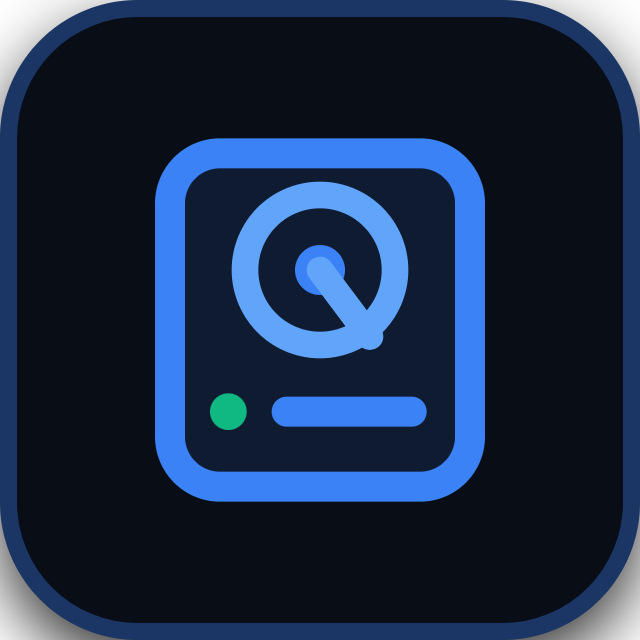

# 🌌 SpaceClean

<div align="center">



### **The Next-Generation, Ultra-Fast Visual Disk Space Analyzer & Safe Storage Cleaner**
*Crafted with precision by **Aneesh***

[](https://github.com/)
[](https://react.dev/)
[](https://www.electronjs.org/)
[](https://www.typescriptlang.org/)
[](LICENSE)

[**Download Installers**](#-native-cross-platform-installers) • [**Key Features**](#-key-features) • [**Quick Start**](#-quick-start) • [**Keyboard Shortcuts**](#-keyboard-shortcuts) • [**Architecture**](#-architecture)

</div>

---

## 📖 Overview

**SpaceClean** is a high-performance, modern desktop application designed to solve disk storage exhaustion on **Windows, macOS, and Linux**. Unlike legacy disk cleaners that freeze when reading massive directories or present walls of unorganized filenames, SpaceClean introduces a **Smart RAM Optimizer**, **Chronological Time Waves**, and a **Live Hardware-Accelerated Media Inspector**.

Scan any folder or entire hard drive (from **50 GB to 2 TB+**) smoothly without RAM bloat, identify forgotten storage hogs across past years, and safely reclaim gigabytes with 1-click Recycle Bin/Trash protection.

---

## ✨ Key Features

### 🧠 1. Smart RAM Optimizer (Part-by-Part Scanning)
- **Automatic Load Detection**: When scanning large locations (50GB–500GB+ / 20k+ files), the scanner keeps memory and system strain near zero.
- **Smooth Part-by-Part Pausing**: Automatically pauses after safe intervals (~20,000 files or ~25 GB) so you can review and clean what was scanned first without lag before continuing.
- **Queue-Based Scanner**: Pauses and resumes seamlessly from directory queues without re-scanning.

### ⏳ 2. Chronological Time Waves (Year & Age Slicing)
- **Time Partitioning**: Automatically breaks any massive folder into chronological year slices (*e.g., Year 2022, Year 2023, Year 2024, Year 2025*).
- **6 Intelligent Sorting Strategies**:
  1. `⏳ Oldest Years First (Old ➔ New)` *(Prime targets for forgotten clutter)*
  2. `🎯 Largest + Oldest (Top Space Recovery)`
  3. `📦 Largest Slices First (Heaviest GB)`
  4. `⚡ Newest Years First (New ➔ Old)`
  5. `📄 Most Files First (Clutter Density)`
  6. `🪶 Smallest Slices First (Quick Wins)`
- **Interactive Table Header Sorting**: Click `Size`, `Modified`, `Name`, or `Type` inside any wave dropdown to sort files instantly with visual directional indicators (`▲` / `▼`).

### 🗂️ 3. 4-Stage Safety Categorization
- **Stage 1 (Safe Quick Wins)**: Temporary installer leftovers, crash dumps, and obsolete cache files (*100% Safe*).
- **Stage 2 (Space Hogs >200MB)**: Massive video captures, disk images (`.iso`), large installers, or VM containers.
- **Stage 3 (Stale & Inactive Files)**: Files untouched for over 180 days that occupy valuable disk storage.
- **Stage 4 (Redundant Duplicate Copies)**: MD5-verified identical file duplicates taking extra storage space.

### 🖼️ 4. Live Media & Source Code Inspector Drawer
- **Hardware-Accelerated Streaming**: Instant preview on click or keyboard navigation.
- **Images**: `.jpg, .png, .webp, .gif, .svg, .bmp, .ico, .avif, .jfif`
- **Video Player**: Inline player with scrubbing controls (`.mp4, .webm, .mkv, .avi, .mov, .wmv, .m4v, .ts`) without file size limits.
- **Audio Player**: Built-in audio playback (`.mp3, .wav, .ogg, .flac, .m4a, .aac, .wma, .opus`).
- **Code & Text**: Full monospace syntax preview (`.txt, .log, .json, .csv, .md, .js, .ts, .py, .html, .css, .yml, .ini, .bat, .ps1`, etc.).
- **PDFs & Documents**: One-click external launcher.

### 🛡️ 5. OS-Level System Protection Engine
- **Windows**: Blocks deletion of `C:\Windows`, `System32`, `WinSxS`, `$Recycle.Bin`, `bootmgr`, `hiberfil.sys`, `.sys`, `.dll`.
- **macOS**: Blocks deletion of `/System`, `/usr`, `/bin`, `/sbin`, `/private/etc`, `/Library/Apple`, Safari, Finder.
- **Linux**: Blocks deletion of `/bin`, `/sbin`, `/etc`, `/boot`, `/sys`, `/proc`, `/dev`, `/lib`.
- **Safe Deletion**: Defaults to moving files to the OS Recycle Bin / Trash with full restoration support.

### 🎨 6. 9 Curated Aesthetic Themes (Dark & Light)
- **Dark Themes**: `Obsidian` (Default), `Midnight OLED`, `Nordic Forest`, `Tokyo Night`, `Ocean Navy`.
- **Light Themes**: `Clean White`, `Warm Sand`, `Arctic Slate`, `Sage Light`.
- **Pre-mount persistence**: Selected theme and mode are restored before React mounts, preventing any white/dark screen flash.

---

## ⌨️ Keyboard Shortcuts

SpaceClean provides full keyboard control across all views:

| Shortcut | Action |
| :--- | :--- |
| `↑` / `↓` **(Arrow Keys)** | Move through file rows; immediately updates the live preview drawer |
| `Spacebar` | Toggle checkbox for the selected file |
| `Enter` | Inspect / open file in default application |
| `Delete` | Open Safe Delete Modal for selected files |
| `Esc` | Close Delete Modal, close Preview Drawer, or blur search |
| `Ctrl+A` / `Cmd+A` | Select all files in active view |
| `Ctrl+D` / `Cmd+D` | Deselect all files |
| `Ctrl+F` or `/` | Focus search bar |
| `Alt+1` to `Alt+6` | Switch between tabs (*Explorer, Folders, Optimizer, Junk, Duplicates, Large Files*) |
| `Tab` / `Shift+Tab` | Accessible focus navigation across all interactive buttons & table rows |

---

## 📦 Native Cross-Platform Installers

SpaceClean can be packaged into native installers for all major platforms:

```bash
# Package for Windows (NSIS Setup .exe & Portable .exe)
npm run package:win

# Package for macOS (.dmg installer & .zip)
npm run package:mac

# Package for Linux (.AppImage & .deb package)
npm run package:linux

# Package for all three platforms
npm run package:all
```

All compiled binaries will be output into the `release/` directory.

---

## 🚀 Quick Start (Running from Source)

### Prerequisites
- [Node.js](https://nodejs.org/) (v18.0 or higher recommended)
- `npm` or `yarn`

### Installation & Launch

1. **Clone the repository**:
   ```bash
   git clone https://github.com/your-username/spaceclean.git
   cd spaceclean
   ```

2. **Install dependencies**:
   ```bash
   npm install
   ```

3. **Start in Development Mode**:
   ```bash
   npm run dev
   ```
   *(Or double-click `start-app.bat` on Windows)*

4. **Build Production Distribution**:
   ```bash
   npm run build
   ```

---

## 🏗️ Architecture

```
spaceclean/
├── electron/
│   ├── main.ts            # Electron main process, IPC handlers & custom protocols
│   ├── preload.ts         # Secure contextBridge API bindings
│   └── scanner.ts         # Multi-platform scanning engine, queue session, junk scanners
├── src/
│   ├── components/
│   │   ├── TitleBar.tsx            # Custom frameless titlebar with 'by Aneesh' & window controls
│   │   ├── Navbar.tsx              # Drive selector & tab switcher
│   │   ├── StatsOverview.tsx       # Real-time metric cards & breakdown charts
│   │   ├── ScanProgressIndicator.tsx # Chunk milestone & percentage loading bar
│   │   ├── FileTable.tsx           # Paginated storage explorer with keyboard focus
│   │   ├── FilePreviewDrawer.tsx   # Live hardware-accelerated media/code inspector
│   │   ├── SmartFolderCleanup.tsx  # Chronological Time Waves & Safety Categories
│   │   ├── FolderExplorer.tsx      # Interactive folder hierarchy tree inspector
│   │   ├── JunkCleaner.tsx         # Cross-platform cache & temp cleaner
│   │   ├── DuplicateFinder.tsx     # MD5 duplicate detection & smart selection
│   │   ├── LargeFilesView.tsx      # Top 100 Space Hogs visualizer
│   │   └── DeleteModal.tsx         # High-contrast dark confirmation & reclaimed summary
│   ├── styles/
│   │   ├── app.css                 # Master design system & component styles
│   │   └── themes.css              # 9 curated dark & light theme color palettes
│   ├── types/
│   │   └── index.ts                # TypeScript interfaces & types
│   ├── App.tsx                     # Main state coordinator & global keyboard shortcuts
│   └── main.tsx                    # React root bootstrap
├── package.json                    # Scripts & electron-builder packaging configuration
└── vite.config.ts                  # Vite + Electron build pipeline
```

---

## 🔒 Privacy & Safety Guarantee

- **100% Offline & Local**: SpaceClean never sends your file paths, filenames, or metrics over the internet. Zero tracking, zero telemetry.
- **Safety Lock**: Crucial operating system binaries and protected kernel files can never be selected or removed.
- **Recycle Bin First**: All delete actions default to moving files into your operating system's Recycle Bin / Trash for instant safety.

---

## 👨‍💻 Author

Developed with ❤️ by **Aneesh**  
Feel free to open issues or contribute to making SpaceClean even better!

---

## 📄 License

This project is licensed under the **MIT License** - see the [LICENSE](LICENSE) file for details.
